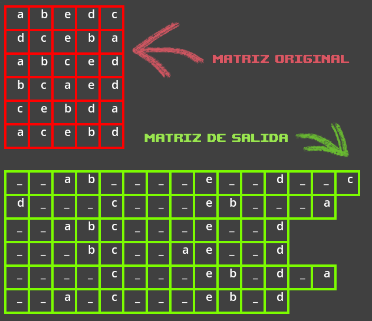

  
Table of Contents

  <ol>
    <li><a href="#about-the-project">Sobre el proyecto</a></li>
    <li><a href="#usage">Usage</a></li>
    <li>
      <a href="#selection-algorithms">Algoritmos de selección</a>
      <ul>
        <li><a href="#roulette-wheel">Selección de ruleta</a></li>
      </ul>
    </li>
    <li><a href="#roadmap">Roadmap</a></li>
    <li><a href="#contact">Contact</a></li>
    <li><a href="#acknowledgments">Acknowledgments</a></li>
  </ol>

## Sobre el proyecto

Los algoritmos genéticos son una técnica de optimización inspirada en el proceso evolutivo natural que se encuentra en la naturaleza. Utilizando conceptos de selección natural, reproducción y mutación, los algoritmos genéticos buscan encontrar soluciones óptimas a problemas complejos en un amplio espectro de disciplinas.

Este enfoque se basa en la idea de que una población de soluciones candidatas puede evolucionar y mejorar a lo largo del tiempo mediante la aplicación de operadores genéticos, como la selección de individuos más aptos, la combinación de características a través de la reproducción y la introducción de variabilidad mediante la mutación.

El algoritmo busca encontrar coincidencias entre las columnas de la matriz de caracteres y separarlas como se vé en la imagen. 

Para validar que el algoritmo cumplió con su meta, debe lográr las siguientes metas:

1.- Cada columna preferencialmente debe contener solo un tipo de caracter

2.- Las columnas deben tener la mayor cantidad de caracteres posibles

## selection algorithms

El programa resive 

(<a href="#readme-top">back to top</a>)

