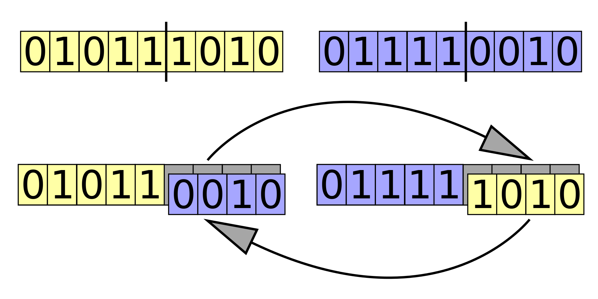

  
Table of Contents

  <ol>
    <li><a href="#1.-Sobre-el-proyecto">Sobre el proyecto</a>
    <ul>
        <li><a href="#Generaciones">Generaciones</a></li>
        <li><a href="#Poblacíón">Poblacíón</a></li>
        <li><a href="#Matriz">Matriz</a></li>
        <li><a href="#Espacios">Espacios</a></li>
        <li><a href="#Población-elite">Población elite</a></li>
      </ul></li>
    <li><a href="#2.-Cómo-funciona">Cómo funciona</a></li>
    <li><a href="#3.-Evaluación">Evaulación</a></li>
    <li><a href="#4.-Técnicas-de-recombinación">Técnicas de recombinación</a></li>
    <li>
      <a href="#5.-Algoritmos-de-selección">Algoritmos de selección</a>
      <ul>
        <li><a href="#selección-de-ruleta">Selección de ruleta</a></li>
      </ul>
    </li>
  </ol>

## 1.- Sobre el proyecto

Los algoritmos genéticos son una técnica de optimización inspirada en el proceso evolutivo natural que se encuentra en la naturaleza. Utilizando conceptos de selección natural, reproducción y mutación, los algoritmos genéticos buscan encontrar soluciones óptimas a problemas complejos en un amplio espectro de disciplinas.

Este enfoque se basa en la idea de que una población de soluciones candidatas puede evolucionar y mejorar a lo largo del tiempo mediante la aplicación de operadores genéticos, como la selección de individuos más aptos, la combinación de características a través de la reproducción y la introducción de variabilidad mediante la mutación.

El algoritmo busca agregar espacios en la matriz de caracteres para encontrar coincidencias entre las columnas y separarlas como se vé en la imagen. 

Para lograr esto, el programa resive 6 parametros.

1.- La matriz con la que se va a trabajar (la cual es generada aleatoriamente).

2.- La población inicial.

3.- La cantidad de generaciones.

4.- La longitud de la matriz.

5.- La altura de la matriz.

6.- La cantidad de espacios que puede tener cada caracter

## 2.- Cómo funciona

Por cada generación, se obtiene una población de individuos, los cuáles tienen cromosomas (representado con un arreglo de números enteros). A cada cromosoma se le asigna un caracter, y su valor representa la cantidad de espacios que se le va a agregar a dicho caracter. 

Los individuos se evalúan y se ordenan de mayor a menor para hacer el proceso de selección y crear una nueva generación, repitiendo este proceso recursivamente hasta llegar a la cantidad de generaciones deseadas.

## 3.-Evaulación

La amplitud en los algoritmos genéticos es una medida que evalúa qué tan adecuada es una solución candidata para resolver el problema en cuestión. En términos simples, representa qué tan bien se desempeña una solución específica en relación con los criterios de optimización definidos.

La función de aptitud asigna un valor numérico a cada solución candidata en la población, donde valores más altos indican soluciones más adecuadas. Este valor puede estar relacionado con la capacidad de la solución para satisfacer restricciones, minimizar o maximizar una función objetivo, o cualquier otro criterio relevante para el problema que se esté abordando.

Para validar que el algoritmo cumplió con su meta, debe lográr los siguientes objetivos:

1.- Cada columna preferencialmente debe contener solo un tipo de caracter.

2.- Las columnas deben tener la mayor cantidad de caracteres posibles.

Para evaluar correctamente esto, cada individuo define una matriz según sus cromosomas, para ir recorriendo sus columnas y sigue las siguientes reglas:

1.- Si la columna tiene más de un caracter, la puntuación no sube ningún punto.

2.- En caso de que la columna solo tenga un solo tipo de caracter, la puntuación sube la cantidad de veces que se repite el caracter elevada al cuadrado.

## Técnica de recombinación

La técnica en la que los individuos se van a reproducir, es la de convinación en un punto, la cuál consiste en dividir los cromosomas en un punto del arreglo al azar para generar a dos hijos candidatos, ambos se mutan y se evalúan para elegir al hijo con mayor valor.

## Algoritmos de selección

La selección en algoritmos genéticos es el proceso de elegir a los individuos más aptos de una población para reproducirse y generar descendencia. Se basa en principios de selección natural, donde los individuos con mejores características tienen más probabilidades de ser seleccionados.

## Selección de ruleta

La selección de ruleta consiste en asignarle una probabilidad a cada individuo según su desempleño al completar la tarea, después se eligen dos individuos al azar para empezar el proceso de recombinación.

(proximos algoritmos por añadir)

(<a href="#readme-top">back to top</a>)

